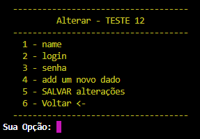
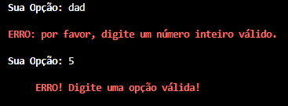

# bills2.0

Este projeto em python permite que você guarde e visualize dados de forma criptografada. Versão melhorada do [Bills1.0](https://github.com/Marod12/bills1.0), ultilizando sqlite3 no lugar de arquivo `.txt`

## Como executar

`
 python main.py
`

## Funcionamento

### Menu principal 

<!-- Imagem -->

### Lista todos serviços

### Cadastro 

> cadastrando 1 serviço
>> 

> cadastrando vários serviços
>> 

### Pesquisa

> sem resultado
>> 

> com 1 resultado
>> 

> com vários resultados
>> 

### Menu serviços 

### Alterar serviço

> menu de alterar
>> 

> alterando um dado
>> 

> resultado da alteração
>> 

> depois de alterado
>> 

### Excluir serviço

### Sair do Sistema

### Alertas

---
# Bills 2.1

## Melhorias

### Funcinalidade de Backup

> Fazer backup
>> 

> Inserir backup 
- *apenas se não tiver nenhum dado armazenado*
>> 
